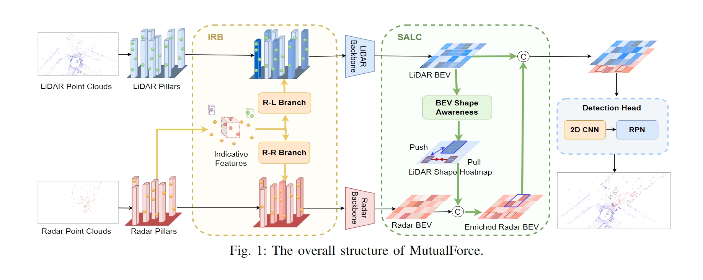

# MutualForce
[ICASSP 2025] This is a repository of MutualForce: Mutual-Aware Enhancement for 4D Radar-LiDAR 3D Object Detection.
The code is mainly based on [OpenPCDet](https://github.com/open-mmlab/OpenPCDet).

## Abstract
Radar and LiDAR have been widely used in autonomous driving as LiDAR provides rich structure information, and radar demonstrates high robustness under adverse weather. Recent studies highlight the effectiveness of fusing radar and LiDAR point clouds. However, challenges remain due to the modality misalignment and information loss during feature extractions. To address these issues, we propose a 4D radar-LiDAR framework to mutually enhance their representations. Initially, the indicative features from radar are utilized to guide both radar and LiDAR geometric feature learning. Subsequently, to mitigate their sparsity gap, the shape information from LiDAR is used to enrich radar BEV features. Extensive experiments on the View-of-Delft (VoD) dataset demonstrate our approach's superiority over existing methods, achieving the highest mAP of 71.76% across the entire area and 86.36% within the driving corridor. Especially for cars, we improve the AP by 4.17% and 4.20% due to the strong indicative features and symmetric shapes.

## Introduction

### Structure
<p align="center">
  
</p>

### Result


## Installation
a. Dataset: Please download the VoD dataset from [VoD Dataset](https://github.com/tudelft-iv/view-of-delft-dataset).

b. Install the dependent libraries as follows:

* Install the dependent python libraries: 
```
pip install -r requirements.txt 
```
c. Generate dataloader
```
python -m pcdet.datasets.astyx.astyx_dataset create_astyx_infos tools/cfgs/dataset_configs/astyx_dataset.yaml
```

## Training
```
CUDA_VISIBLE_DEVICES=1 python train.py --cfg_file cfgs/astyx_models/pointpillar.yaml --tcp_port 25851 --extra_tag yourmodelname
```

## Testing
```
python test.py --cfg_file cfgs/astyx_models/pointpillar.yaml --batch_size 4 --ckpt ##astyx_models/pointpillar/debug/ckpt/checkpoint_epoch_80.pth
```

## Citation 
If you find this project useful in your research, please consider cite:


```
@INPROCEEDINGS{10887748,
  author={Peng, Xiangyuan and Sun, Huawei and Bierzynski, Kay and Fischbacher, Anton and Servadei, Lorenzo and Wille, Robert},
  booktitle={ICASSP 2025 - 2025 IEEE International Conference on Acoustics, Speech and Signal Processing (ICASSP)}, 
  title={MutualForce: Mutual-Aware Enhancement for 4D Radar-LiDAR 3D Object Detection}, 
  year={2025},
  doi={10.1109/ICASSP49660.2025.10887748}}
```
